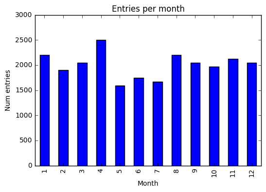
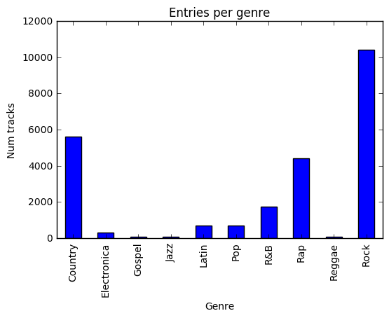
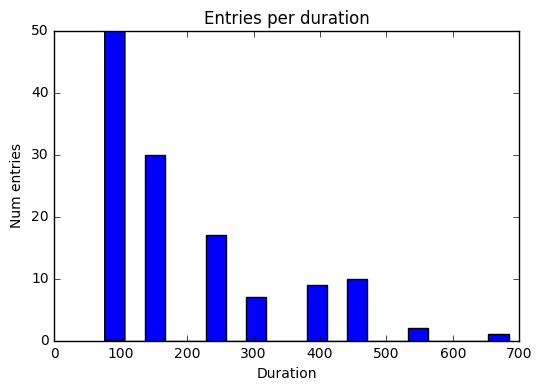
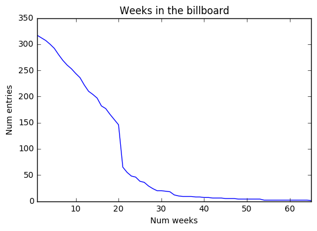
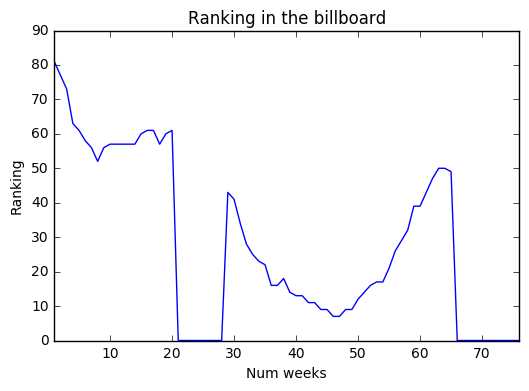

# Project 2
## Step 1: Exploring your data.

##### Load your data in using Pandas and start to explore. Save all of your early exploration code here and include in your final submission.


```python
import pandas as pd
import matplotlib.pyplot as plt
from __future__ import division, print_function, unicode_literals
%matplotlib inline

bb_df = pd.read_csv("../images/2016-10-24-project/billboard.csv")
bb_df.head()
```

<div>
<table border="1" class="dataframe">
  <thead>
    <tr style="text-align: right;">
      <th></th>
      <th>year</th>
      <th>artist.inverted</th>
      <th>track</th>
      <th>time</th>
      <th>genre</th>
      <th>date.entered</th>
      <th>date.peaked</th>
      <th>x1st.week</th>
      <th>x2nd.week</th>
      <th>x3rd.week</th>
      <th>...</th>
      <th>x67th.week</th>
      <th>x68th.week</th>
      <th>x69th.week</th>
      <th>x70th.week</th>
      <th>x71st.week</th>
      <th>x72nd.week</th>
      <th>x73rd.week</th>
      <th>x74th.week</th>
      <th>x75th.week</th>
      <th>x76th.week</th>
    </tr>
  </thead>
  <tbody>
    <tr>
      <th>0</th>
      <td>2000</td>
      <td>Destiny's Child</td>
      <td>Independent Women Part I</td>
      <td>3:38</td>
      <td>Rock</td>
      <td>2000-09-23</td>
      <td>2000-11-18</td>
      <td>78</td>
      <td>63.0</td>
      <td>49.0</td>
      <td>...</td>
      <td>NaN</td>
      <td>NaN</td>
      <td>NaN</td>
      <td>NaN</td>
      <td>NaN</td>
      <td>NaN</td>
      <td>NaN</td>
      <td>NaN</td>
      <td>NaN</td>
      <td>NaN</td>
    </tr>
    <tr>
      <th>1</th>
      <td>2000</td>
      <td>Santana</td>
      <td>Maria, Maria</td>
      <td>4:18</td>
      <td>Rock</td>
      <td>2000-02-12</td>
      <td>2000-04-08</td>
      <td>15</td>
      <td>8.0</td>
      <td>6.0</td>
      <td>...</td>
      <td>NaN</td>
      <td>NaN</td>
      <td>NaN</td>
      <td>NaN</td>
      <td>NaN</td>
      <td>NaN</td>
      <td>NaN</td>
      <td>NaN</td>
      <td>NaN</td>
      <td>NaN</td>
    </tr>
    <tr>
      <th>2</th>
      <td>2000</td>
      <td>Savage Garden</td>
      <td>I Knew I Loved You</td>
      <td>4:07</td>
      <td>Rock</td>
      <td>1999-10-23</td>
      <td>2000-01-29</td>
      <td>71</td>
      <td>48.0</td>
      <td>43.0</td>
      <td>...</td>
      <td>NaN</td>
      <td>NaN</td>
      <td>NaN</td>
      <td>NaN</td>
      <td>NaN</td>
      <td>NaN</td>
      <td>NaN</td>
      <td>NaN</td>
      <td>NaN</td>
      <td>NaN</td>
    </tr>
    <tr>
      <th>3</th>
      <td>2000</td>
      <td>Madonna</td>
      <td>Music</td>
      <td>3:45</td>
      <td>Rock</td>
      <td>2000-08-12</td>
      <td>2000-09-16</td>
      <td>41</td>
      <td>23.0</td>
      <td>18.0</td>
      <td>...</td>
      <td>NaN</td>
      <td>NaN</td>
      <td>NaN</td>
      <td>NaN</td>
      <td>NaN</td>
      <td>NaN</td>
      <td>NaN</td>
      <td>NaN</td>
      <td>NaN</td>
      <td>NaN</td>
    </tr>
    <tr>
      <th>4</th>
      <td>2000</td>
      <td>Aguilera, Christina</td>
      <td>Come On Over Baby (All I Want Is You)</td>
      <td>3:38</td>
      <td>Rock</td>
      <td>2000-08-05</td>
      <td>2000-10-14</td>
      <td>57</td>
      <td>47.0</td>
      <td>45.0</td>
      <td>...</td>
      <td>NaN</td>
      <td>NaN</td>
      <td>NaN</td>
      <td>NaN</td>
      <td>NaN</td>
      <td>NaN</td>
      <td>NaN</td>
      <td>NaN</td>
      <td>NaN</td>
      <td>NaN</td>
    </tr>
  </tbody>
</table>
<p>5 rows × 83 columns</p>
</div>


##### Write a brief description of your data, and any interesting observations you've made thus far. 


```python
bb_df.describe()
```


<div>
<table border="1" class="dataframe">
  <thead>
    <tr style="text-align: right;">
      <th></th>
      <th>year</th>
      <th>x1st.week</th>
      <th>x2nd.week</th>
      <th>x3rd.week</th>
      <th>x4th.week</th>
      <th>x5th.week</th>
      <th>x6th.week</th>
      <th>x7th.week</th>
      <th>x8th.week</th>
      <th>x9th.week</th>
      <th>...</th>
      <th>x67th.week</th>
      <th>x68th.week</th>
      <th>x69th.week</th>
      <th>x70th.week</th>
      <th>x71st.week</th>
      <th>x72nd.week</th>
      <th>x73rd.week</th>
      <th>x74th.week</th>
      <th>x75th.week</th>
      <th>x76th.week</th>
    </tr>
  </thead>
  <tbody>
    <tr>
      <th>count</th>
      <td>317.0</td>
      <td>317.000000</td>
      <td>312.000000</td>
      <td>307.000000</td>
      <td>300.000000</td>
      <td>292.000000</td>
      <td>280.000000</td>
      <td>269.000000</td>
      <td>260.000000</td>
      <td>253.000000</td>
      <td>...</td>
      <td>0.0</td>
      <td>0.0</td>
      <td>0.0</td>
      <td>0.0</td>
      <td>0.0</td>
      <td>0.0</td>
      <td>0.0</td>
      <td>0.0</td>
      <td>0.0</td>
      <td>0.0</td>
    </tr>
    <tr>
      <th>mean</th>
      <td>2000.0</td>
      <td>79.958991</td>
      <td>71.173077</td>
      <td>65.045603</td>
      <td>59.763333</td>
      <td>56.339041</td>
      <td>52.360714</td>
      <td>49.219331</td>
      <td>47.119231</td>
      <td>46.343874</td>
      <td>...</td>
      <td>NaN</td>
      <td>NaN</td>
      <td>NaN</td>
      <td>NaN</td>
      <td>NaN</td>
      <td>NaN</td>
      <td>NaN</td>
      <td>NaN</td>
      <td>NaN</td>
      <td>NaN</td>
    </tr>
    <tr>
      <th>std</th>
      <td>0.0</td>
      <td>14.686865</td>
      <td>18.200443</td>
      <td>20.752302</td>
      <td>22.324619</td>
      <td>23.780022</td>
      <td>24.473273</td>
      <td>25.654279</td>
      <td>26.370782</td>
      <td>27.136419</td>
      <td>...</td>
      <td>NaN</td>
      <td>NaN</td>
      <td>NaN</td>
      <td>NaN</td>
      <td>NaN</td>
      <td>NaN</td>
      <td>NaN</td>
      <td>NaN</td>
      <td>NaN</td>
      <td>NaN</td>
    </tr>
    <tr>
      <th>min</th>
      <td>2000.0</td>
      <td>15.000000</td>
      <td>8.000000</td>
      <td>6.000000</td>
      <td>5.000000</td>
      <td>2.000000</td>
      <td>1.000000</td>
      <td>1.000000</td>
      <td>1.000000</td>
      <td>1.000000</td>
      <td>...</td>
      <td>NaN</td>
      <td>NaN</td>
      <td>NaN</td>
      <td>NaN</td>
      <td>NaN</td>
      <td>NaN</td>
      <td>NaN</td>
      <td>NaN</td>
      <td>NaN</td>
      <td>NaN</td>
    </tr>
    <tr>
      <th>25%</th>
      <td>2000.0</td>
      <td>74.000000</td>
      <td>NaN</td>
      <td>NaN</td>
      <td>NaN</td>
      <td>NaN</td>
      <td>NaN</td>
      <td>NaN</td>
      <td>NaN</td>
      <td>NaN</td>
      <td>...</td>
      <td>NaN</td>
      <td>NaN</td>
      <td>NaN</td>
      <td>NaN</td>
      <td>NaN</td>
      <td>NaN</td>
      <td>NaN</td>
      <td>NaN</td>
      <td>NaN</td>
      <td>NaN</td>
    </tr>
    <tr>
      <th>50%</th>
      <td>2000.0</td>
      <td>81.000000</td>
      <td>NaN</td>
      <td>NaN</td>
      <td>NaN</td>
      <td>NaN</td>
      <td>NaN</td>
      <td>NaN</td>
      <td>NaN</td>
      <td>NaN</td>
      <td>...</td>
      <td>NaN</td>
      <td>NaN</td>
      <td>NaN</td>
      <td>NaN</td>
      <td>NaN</td>
      <td>NaN</td>
      <td>NaN</td>
      <td>NaN</td>
      <td>NaN</td>
      <td>NaN</td>
    </tr>
    <tr>
      <th>75%</th>
      <td>2000.0</td>
      <td>91.000000</td>
      <td>NaN</td>
      <td>NaN</td>
      <td>NaN</td>
      <td>NaN</td>
      <td>NaN</td>
      <td>NaN</td>
      <td>NaN</td>
      <td>NaN</td>
      <td>...</td>
      <td>NaN</td>
      <td>NaN</td>
      <td>NaN</td>
      <td>NaN</td>
      <td>NaN</td>
      <td>NaN</td>
      <td>NaN</td>
      <td>NaN</td>
      <td>NaN</td>
      <td>NaN</td>
    </tr>
    <tr>
      <th>max</th>
      <td>2000.0</td>
      <td>100.000000</td>
      <td>100.000000</td>
      <td>100.000000</td>
      <td>100.000000</td>
      <td>100.000000</td>
      <td>99.000000</td>
      <td>100.000000</td>
      <td>99.000000</td>
      <td>100.000000</td>
      <td>...</td>
      <td>NaN</td>
      <td>NaN</td>
      <td>NaN</td>
      <td>NaN</td>
      <td>NaN</td>
      <td>NaN</td>
      <td>NaN</td>
      <td>NaN</td>
      <td>NaN</td>
      <td>NaN</td>
    </tr>
  </tbody>
</table>
<p>8 rows x 77 columns</p>
</div>


```python
bb_df.info()
```

    <class 'pandas.core.frame.DataFrame'>
    RangeIndex: 317 entries, 0 to 316
    Data columns (total 83 columns):
    year               317 non-null int64
    artist.inverted    317 non-null object
    track              317 non-null object
    time               317 non-null object
    genre              317 non-null object
    date.entered       317 non-null object
    date.peaked        317 non-null object
    x1st.week          317 non-null int64
    x2nd.week          312 non-null float64
    x3rd.week          307 non-null float64
    x4th.week          300 non-null float64
    x5th.week          292 non-null float64
    x6th.week          280 non-null float64
    x7th.week          269 non-null float64
    x8th.week          260 non-null float64
    x9th.week          253 non-null float64
    x10th.week         244 non-null float64
    x11th.week         236 non-null float64
    x12th.week         222 non-null float64
    x13th.week         210 non-null float64
    x14th.week         204 non-null float64
    x15th.week         197 non-null float64
    x16th.week         182 non-null float64
    x17th.week         177 non-null float64
    x18th.week         166 non-null float64
    x19th.week         156 non-null float64
    x20th.week         146 non-null float64
    x21st.week         65 non-null float64
    x22nd.week         55 non-null float64
    x23rd.week         48 non-null float64
    x24th.week         46 non-null float64
    x25th.week         38 non-null float64
    x26th.week         36 non-null float64
    x27th.week         29 non-null float64
    x28th.week         24 non-null float64
    x29th.week         20 non-null float64
    x30th.week         20 non-null float64
    x31st.week         19 non-null float64
    x32nd.week         18 non-null float64
    x33rd.week         12 non-null float64
    x34th.week         10 non-null float64
    x35th.week         9 non-null float64
    x36th.week         9 non-null float64
    x37th.week         9 non-null float64
    x38th.week         8 non-null float64
    x39th.week         8 non-null float64
    x40th.week         7 non-null float64
    x41st.week         7 non-null float64
    x42nd.week         6 non-null float64
    x43rd.week         6 non-null float64
    x44th.week         6 non-null float64
    x45th.week         5 non-null float64
    x46th.week         5 non-null float64
    x47th.week         5 non-null float64
    x48th.week         4 non-null float64
    x49th.week         4 non-null float64
    x50th.week         4 non-null float64
    x51st.week         4 non-null float64
    x52nd.week         4 non-null float64
    x53rd.week         4 non-null float64
    x54th.week         2 non-null float64
    x55th.week         2 non-null float64
    x56th.week         2 non-null float64
    x57th.week         2 non-null float64
    x58th.week         2 non-null float64
    x59th.week         2 non-null float64
    x60th.week         2 non-null float64
    x61st.week         2 non-null float64
    x62nd.week         2 non-null float64
    x63rd.week         2 non-null float64
    x64th.week         2 non-null float64
    x65th.week         1 non-null float64
    x66th.week         0 non-null float64
    x67th.week         0 non-null float64
    x68th.week         0 non-null float64
    x69th.week         0 non-null float64
    x70th.week         0 non-null float64
    x71st.week         0 non-null float64
    x72nd.week         0 non-null float64
    x73rd.week         0 non-null float64
    x74th.week         0 non-null float64
    x75th.week         0 non-null float64
    x76th.week         0 non-null float64
    dtypes: float64(75), int64(2), object(6)
    memory usage: 205.6+ KB


```python
# find out if all track names are unique
len(bb_df["track"].unique())
```


    316


### First impressions about the data

There are 317 rows, each corresponding to a unique track.

All tracks have 2000 as their year (in the result of .describe(), min=max=2000).

This dataframe has 83 columns with information about each track.  The initial columns have no missing values, but some of their titles and data types need to be adjusted (especially the dates).

- year               317 non-null int64
- artist.inverted    317 non-null object
- track              317 non-null object
- time               317 non-null object
- genre              317 non-null object
- date.entered       317 non-null object
- date.peaked        317 non-null object
- x1st.week          317 non-null int64

The last columns can be eliminated, because no track was on the billboard for more than 65 weeks.

As expected, the number of non-null values decreases monotonically as the number of weeks increases.

The best position for a track in their first week on the billboard was 15th (min for 1st week in .describe()).

It takes at least 6 weeks of being in the billboard for a track to reach first position (this is the fist column with min=1 in .describe())

## Step 2: Clean your data.

##### Do some rudimentary cleaning. Rename any columns that are poorly named, shorten any strings that may be too long, check for missing values (and replace them if it makes sense to do so). Explain your rationale for the way you choose to "impute" the missing data.


```python
# Renaming artist.inverted, date.entered, date.peaked

bb_df.rename(columns={"artist.inverted": "artist", 
                      "date.entered": "entered",
                      "date.peaked": "peaked"}, inplace=True)

# The initial columns have no missing values, I think that the 
# missing values in the weeks columns are usefull.  
# May need to change them latter on.
# Ended up changing them to allow the data type to be int.
# bb_df.fillna("NaN")
# Can change them into ints this way
bb_df.loc[:,'x1st.week':'x76th.week'] = bb_df.loc[:,'x1st.week':'x76th.week'].fillna(0.0).astype(int)

# I would remove the last columns, because they only have missing values.
# Decided not to do so because of the next question.

# Turn date columns into datetime, time into time and genre into category.
bb_df["entered"] = pd.to_datetime(bb_df["entered"], yearfirst=True)
bb_df["peaked"] = pd.to_datetime(bb_df["peaked"], yearfirst=True)
bb_df["time"] = pd.to_timedelta("0:"+bb_df["time"])
bb_df["genre"] = bb_df["genre"].astype("category")

bb_df.info()
```

    <class 'pandas.core.frame.DataFrame'>
    RangeIndex: 317 entries, 0 to 316
    Data columns (total 83 columns):
    year          317 non-null int64
    artist        317 non-null object
    track         317 non-null object
    time          317 non-null timedelta64[ns]
    genre         317 non-null category
    entered       317 non-null datetime64[ns]
    peaked        317 non-null datetime64[ns]
    x1st.week     317 non-null int64
    x2nd.week     317 non-null int64
    x3rd.week     317 non-null int64
    x4th.week     317 non-null int64
    x5th.week     317 non-null int64
    x6th.week     317 non-null int64
    x7th.week     317 non-null int64
    x8th.week     317 non-null int64
    x9th.week     317 non-null int64
    x10th.week    317 non-null int64
    x11th.week    317 non-null int64
    x12th.week    317 non-null int64
    x13th.week    317 non-null int64
    x14th.week    317 non-null int64
    x15th.week    317 non-null int64
    x16th.week    317 non-null int64
    x17th.week    317 non-null int64
    x18th.week    317 non-null int64
    x19th.week    317 non-null int64
    x20th.week    317 non-null int64
    x21st.week    317 non-null int64
    x22nd.week    317 non-null int64
    x23rd.week    317 non-null int64
    x24th.week    317 non-null int64
    x25th.week    317 non-null int64
    x26th.week    317 non-null int64
    x27th.week    317 non-null int64
    x28th.week    317 non-null int64
    x29th.week    317 non-null int64
    x30th.week    317 non-null int64
    x31st.week    317 non-null int64
    x32nd.week    317 non-null int64
    x33rd.week    317 non-null int64
    x34th.week    317 non-null int64
    x35th.week    317 non-null int64
    x36th.week    317 non-null int64
    x37th.week    317 non-null int64
    x38th.week    317 non-null int64
    x39th.week    317 non-null int64
    x40th.week    317 non-null int64
    x41st.week    317 non-null int64
    x42nd.week    317 non-null int64
    x43rd.week    317 non-null int64
    x44th.week    317 non-null int64
    x45th.week    317 non-null int64
    x46th.week    317 non-null int64
    x47th.week    317 non-null int64
    x48th.week    317 non-null int64
    x49th.week    317 non-null int64
    x50th.week    317 non-null int64
    x51st.week    317 non-null int64
    x52nd.week    317 non-null int64
    x53rd.week    317 non-null int64
    x54th.week    317 non-null int64
    x55th.week    317 non-null int64
    x56th.week    317 non-null int64
    x57th.week    317 non-null int64
    x58th.week    317 non-null int64
    x59th.week    317 non-null int64
    x60th.week    317 non-null int64
    x61st.week    317 non-null int64
    x62nd.week    317 non-null int64
    x63rd.week    317 non-null int64
    x64th.week    317 non-null int64
    x65th.week    317 non-null int64
    x66th.week    317 non-null int64
    x67th.week    317 non-null int64
    x68th.week    317 non-null int64
    x69th.week    317 non-null int64
    x70th.week    317 non-null int64
    x71st.week    317 non-null int64
    x72nd.week    317 non-null int64
    x73rd.week    317 non-null int64
    x74th.week    317 non-null int64
    x75th.week    317 non-null int64
    x76th.week    317 non-null int64
    dtypes: category(1), datetime64[ns](2), int64(77), object(2), timedelta64[ns](1)
    memory usage: 203.5+ KB


##### Using Pandas' built in `melt` function, pivot the weekly ranking data to be long rather than wide. As a result, you will have removed the 72 'week' columns and replace it with two: Week and Ranking. There will now be multiple entries for each song, one for each week on the Billboard rankings.


```python
bb_long_df = pd.melt(bb_df, 
                     id_vars=["track", "year", "artist", "genre", "time", "entered", "peaked"], 
                     var_name='week', value_name='ranking')
# genre was no longer a category, turn to category again
bb_long_df["genre"] = bb_long_df["genre"].astype("category")
bb_long_df.info()
bb_long_df.head(10)
```

    <class 'pandas.core.frame.DataFrame'>
    RangeIndex: 24092 entries, 0 to 24091
    Data columns (total 9 columns):
    track      24092 non-null object
    year       24092 non-null int64
    artist     24092 non-null object
    genre      24092 non-null category
    time       24092 non-null timedelta64[ns]
    entered    24092 non-null datetime64[ns]
    peaked     24092 non-null datetime64[ns]
    week       24092 non-null object
    ranking    24092 non-null int64
    dtypes: category(1), datetime64[ns](2), int64(2), object(3), timedelta64[ns](1)
    memory usage: 1.5+ MB


<div>
<table border="1" class="dataframe">
  <thead>
    <tr style="text-align: right;">
      <th></th>
      <th>track</th>
      <th>year</th>
      <th>artist</th>
      <th>genre</th>
      <th>time</th>
      <th>entered</th>
      <th>peaked</th>
      <th>week</th>
      <th>ranking</th>
    </tr>
  </thead>
  <tbody>
    <tr>
      <th>0</th>
      <td>Independent Women Part I</td>
      <td>2000</td>
      <td>Destiny's Child</td>
      <td>Rock</td>
      <td>00:03:38</td>
      <td>2000-09-23</td>
      <td>2000-11-18</td>
      <td>x1st.week</td>
      <td>78</td>
    </tr>
    <tr>
      <th>1</th>
      <td>Maria, Maria</td>
      <td>2000</td>
      <td>Santana</td>
      <td>Rock</td>
      <td>00:04:18</td>
      <td>2000-02-12</td>
      <td>2000-04-08</td>
      <td>x1st.week</td>
      <td>15</td>
    </tr>
    <tr>
      <th>2</th>
      <td>I Knew I Loved You</td>
      <td>2000</td>
      <td>Savage Garden</td>
      <td>Rock</td>
      <td>00:04:07</td>
      <td>1999-10-23</td>
      <td>2000-01-29</td>
      <td>x1st.week</td>
      <td>71</td>
    </tr>
    <tr>
      <th>3</th>
      <td>Music</td>
      <td>2000</td>
      <td>Madonna</td>
      <td>Rock</td>
      <td>00:03:45</td>
      <td>2000-08-12</td>
      <td>2000-09-16</td>
      <td>x1st.week</td>
      <td>41</td>
    </tr>
    <tr>
      <th>4</th>
      <td>Come On Over Baby (All I Want Is You)</td>
      <td>2000</td>
      <td>Aguilera, Christina</td>
      <td>Rock</td>
      <td>00:03:38</td>
      <td>2000-08-05</td>
      <td>2000-10-14</td>
      <td>x1st.week</td>
      <td>57</td>
    </tr>
    <tr>
      <th>5</th>
      <td>Doesn't Really Matter</td>
      <td>2000</td>
      <td>Janet</td>
      <td>Rock</td>
      <td>00:04:17</td>
      <td>2000-06-17</td>
      <td>2000-08-26</td>
      <td>x1st.week</td>
      <td>59</td>
    </tr>
    <tr>
      <th>6</th>
      <td>Say My Name</td>
      <td>2000</td>
      <td>Destiny's Child</td>
      <td>Rock</td>
      <td>00:04:31</td>
      <td>1999-12-25</td>
      <td>2000-03-18</td>
      <td>x1st.week</td>
      <td>83</td>
    </tr>
    <tr>
      <th>7</th>
      <td>Be With You</td>
      <td>2000</td>
      <td>Iglesias, Enrique</td>
      <td>Latin</td>
      <td>00:03:36</td>
      <td>2000-04-01</td>
      <td>2000-06-24</td>
      <td>x1st.week</td>
      <td>63</td>
    </tr>
    <tr>
      <th>8</th>
      <td>Incomplete</td>
      <td>2000</td>
      <td>Sisqo</td>
      <td>Rock</td>
      <td>00:03:52</td>
      <td>2000-06-24</td>
      <td>2000-08-12</td>
      <td>x1st.week</td>
      <td>77</td>
    </tr>
    <tr>
      <th>9</th>
      <td>Amazed</td>
      <td>2000</td>
      <td>Lonestar</td>
      <td>Country</td>
      <td>00:04:25</td>
      <td>1999-06-05</td>
      <td>2000-03-04</td>
      <td>x1st.week</td>
      <td>81</td>
    </tr>
  </tbody>
</table>
</div>


```python
# Now the values in the week column make little sense,
# Change them into ints.
bb_long_df["week"] = bb_long_df["week"].str.extract('(\d+)', expand=True).astype(int)
bb_long_df.head(10)
```


<div>
<table border="1" class="dataframe">
  <thead>
    <tr style="text-align: right;">
      <th></th>
      <th>track</th>
      <th>year</th>
      <th>artist</th>
      <th>genre</th>
      <th>time</th>
      <th>entered</th>
      <th>peaked</th>
      <th>week</th>
      <th>ranking</th>
    </tr>
  </thead>
  <tbody>
    <tr>
      <th>0</th>
      <td>Independent Women Part I</td>
      <td>2000</td>
      <td>Destiny's Child</td>
      <td>Rock</td>
      <td>00:03:38</td>
      <td>2000-09-23</td>
      <td>2000-11-18</td>
      <td>1</td>
      <td>78</td>
    </tr>
    <tr>
      <th>1</th>
      <td>Maria, Maria</td>
      <td>2000</td>
      <td>Santana</td>
      <td>Rock</td>
      <td>00:04:18</td>
      <td>2000-02-12</td>
      <td>2000-04-08</td>
      <td>1</td>
      <td>15</td>
    </tr>
    <tr>
      <th>2</th>
      <td>I Knew I Loved You</td>
      <td>2000</td>
      <td>Savage Garden</td>
      <td>Rock</td>
      <td>00:04:07</td>
      <td>1999-10-23</td>
      <td>2000-01-29</td>
      <td>1</td>
      <td>71</td>
    </tr>
    <tr>
      <th>3</th>
      <td>Music</td>
      <td>2000</td>
      <td>Madonna</td>
      <td>Rock</td>
      <td>00:03:45</td>
      <td>2000-08-12</td>
      <td>2000-09-16</td>
      <td>1</td>
      <td>41</td>
    </tr>
    <tr>
      <th>4</th>
      <td>Come On Over Baby (All I Want Is You)</td>
      <td>2000</td>
      <td>Aguilera, Christina</td>
      <td>Rock</td>
      <td>00:03:38</td>
      <td>2000-08-05</td>
      <td>2000-10-14</td>
      <td>1</td>
      <td>57</td>
    </tr>
    <tr>
      <th>5</th>
      <td>Doesn't Really Matter</td>
      <td>2000</td>
      <td>Janet</td>
      <td>Rock</td>
      <td>00:04:17</td>
      <td>2000-06-17</td>
      <td>2000-08-26</td>
      <td>1</td>
      <td>59</td>
    </tr>
    <tr>
      <th>6</th>
      <td>Say My Name</td>
      <td>2000</td>
      <td>Destiny's Child</td>
      <td>Rock</td>
      <td>00:04:31</td>
      <td>1999-12-25</td>
      <td>2000-03-18</td>
      <td>1</td>
      <td>83</td>
    </tr>
    <tr>
      <th>7</th>
      <td>Be With You</td>
      <td>2000</td>
      <td>Iglesias, Enrique</td>
      <td>Latin</td>
      <td>00:03:36</td>
      <td>2000-04-01</td>
      <td>2000-06-24</td>
      <td>1</td>
      <td>63</td>
    </tr>
    <tr>
      <th>8</th>
      <td>Incomplete</td>
      <td>2000</td>
      <td>Sisqo</td>
      <td>Rock</td>
      <td>00:03:52</td>
      <td>2000-06-24</td>
      <td>2000-08-12</td>
      <td>1</td>
      <td>77</td>
    </tr>
    <tr>
      <th>9</th>
      <td>Amazed</td>
      <td>2000</td>
      <td>Lonestar</td>
      <td>Country</td>
      <td>00:04:25</td>
      <td>1999-06-05</td>
      <td>2000-03-04</td>
      <td>1</td>
      <td>81</td>
    </tr>
  </tbody>
</table>
</div>


## Step 3: Visualize your data.

##### Using a plotting utility of your choice (Tableau or python modules or both), create visualizations that will provide context to your data. There is no minimum or maximum number of graphs you should generate, but there should be a clear and consistent story being told. Give insights to the distribution, statistics, and relationships of the data. 


```python
# Which month sees more entries into the billboard?

month_pivot = pd.pivot_table(bb_long_df, 
                             index=[bb_long_df["entered"].dt.month], 
                             values=["year"], aggfunc=len)
month_pivot.plot(kind="bar", legend=False, title="Entries per month")
plt.xlabel("Month")
plt.ylabel("Num entries")
plt.show()

# We can see that May, June and July see the smallest number of
# entries into the billboard.
```





```python
# Which music genre has more tracks in the billboard?

genre_pivot = pd.pivot_table(bb_long_df, 
                             index=["genre"], 
                             values=["year"], aggfunc=len)
genre_pivot.plot(kind="bar", legend=False, title="Entries per genre")
plt.xlabel("Genre")
plt.ylabel("Num tracks")
plt.show()

# We can see that Rock is by far the clear winner, probably
# because it's a very wide donomination.
```





```python
# Is there an ideal duration for a track?

duration_pivot = pd.pivot_table(bb_long_df, 
                             index=[bb_long_df["time"].dt.seconds], 
                             values=["year"], aggfunc=len)
duration_pivot.plot(kind="hist", bins=20, legend=False, title="Entries per duration")
plt.xlabel("Duration")
plt.ylabel("Num entries")
plt.show()
# We can see that tracks around 100 seconds long are more likely
# to get into the billboard.  In general, the gonger the track
# the least likely it is to stay in the billbaord.
```





```python
# How many weeks do tracks tend to stay in the billboard?
week_long_pivot = pd.pivot_table(bb_long_df[bb_long_df["ranking"]>0], 
                                 index=["week"], 
                                 values=["track"], aggfunc=len)
week_long_pivot.plot(kind="line", legend=False, title="Weeks in the billboard")
plt.xlabel("Num weeks")
plt.ylabel("Num entries")
plt.show()
# We can see that the number of weeks in the billboard decreases
# very sharply around 20 weeks, and that only a very small number
# of tracks stay in the billboard more than 502 weeks (or one year).
# The longest number of weeks in the bilboard for this dataset is 65.
```





```python
# How did the ranking change for the track that stayed longer in the billboard?

# find the maximum number of weeks in the billboard
bb_long_df[bb_long_df["ranking"]>0]["week"].max()
# result is 65

# find the track
bb_long_df[(bb_long_df["ranking"]>0) & (bb_long_df["week"]==65)]
# result is Higher by Creed

# How did its ranking vary during those 65 weeks?
higher_rankings = bb_long_df[bb_long_df["track"]=="Higher"][["week", "ranking"]].set_index("week")

higher_rankings.plot(kind="line", legend=False, title="Ranking in the billboard")
plt.xlabel("Num weeks")
plt.ylabel("Ranking")
plt.show()
# We can see that this track left the billboard between weeks 21 and 28, 
# but returned in week 29 to the 43rd position, managing to stay in the
# bilboard until week 65.
```





## Step 4: Create a Problem Statement.

##### Having explored the data, come up with a problem statement for this data set. You can feel free to introduce data from any other source to support your problem statement, just be sure to provide a link to the origin of the data. Once again- be creative!


```python
# Some very simple problem statements were ilustrated with the previous question.

# After two weeks of 11-hour work days, plus 2-hour commutes and work on weekends
# I do not feel the least creative.

# In fact, the negative correlation between crativity and stress 
# is weel documented.
# http://contextualfeed.com/stress-and-its-impact-on-ones-creativity-288.html
# https://litreactor.com/columns/how-stress-assassinates-creativity

# Not that I read these posts, but the big font sentences seem to 
# agree that stress kills creativity...

# I am sure I could come up with interesting stuff after a long walk
# in the woods, if I managed to do that...
```

## Step 5: Brainstorm your Approach.
##### In bullet-list form, provide a proposed approach for evaluating your problem statement. This can be somewhat high-level, but start to think about ways you can massage the data for maximum efficacy. 

It would be interesting to know:
- Do artist gender, country of origin, language, influence how long a track stays in the billbard?
  We would need to be able to determine the artist's gender, country of origin and track language from different datasets.
- Are billbords similar across different countries?
- Are there music genres that are more popular in some countries than others?

## Step 6: Create a blog post with your code snippets and visualizations.
##### Data Science is a growing field, and the Tech industry thrives off of collaboration and sharing of knowledge. Blogging is a powerful means for pushing the needle forward in our field. Using your blogging platform of choice, create a post describing each of the 5 steps above. Rather than writing a procedural text, imagine you're describing the data, visualizations, and conclusions you've arrived at to your peers. Aim for a minimum of 500 words. 

I tried to export the notebook and import it to the blog on Github, but for some reason Github doesn't let me upload the files.

## BONUS: The Content Managers working for the Podcast Publishing Company have recognized you as a thought leader in your field. They've asked you to pen a white paper (minimum 500 words) on the subject of 'What It Means To Have Clean Data'. This will be an opinion piece read by a wide audience, so be sure to back up your statements with real world examples or scenarios.

##### Hint: To get started, look around on the internet for articles, blog posts, papers, youtube videos, podcasts, reddit discussions, anything that will help you understand the challenges and implications of dealing with big data. This should be a personal reflection on everything you've learned this week, and the learning goals that have been set out for you going forward. 

Check pdf in the project files, it's called white-paper-on-cleaning-data.pdf, or click the folowing link to open the file in a different tab.

[white-paper-on-cleaning-data.pdf](../images/2016-10-24-project/white-paper-on-cleaning-data.pdf)
