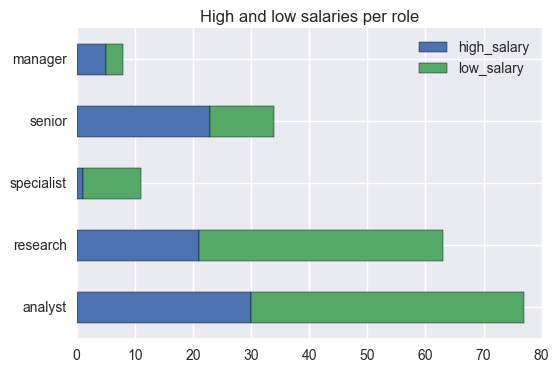

# Web Scraping for Indeed.com & Predicting Salaries

We are going to collect salary information on data science jobs in a variety of markets. Then using the location, title and summary of the job we will attempt to predict the salary of the job. For job posting sites, this would be extraordinarily useful. While most listings DO NOT come with salary information, being to able extrapolate or predict the expected salaries from other listings can help guide negotiations.

# Problem statement
Are high salaries for data scientist roles related to the cities where they are available?

Are high salaries for data scientist roles related to some specific words in the job title?

The aim of this project is to answer these questions using data scraped from indeed.com.

# Summary for project 4

The first part of this project turned out to be the one that took the greatest amount of time.     Even web pages that are supposedly easy to scrape turn out to be a challenge, with the additional caveat that they can change over time.

One of the lessons learned is that it's important to save the scraped data regularly, if we are to be able to reproduce our results.

After having the data, I realised that many rows were repeated and very few rows contained salary information (around 200 out of 56000).  Because of time constraints, I decided to continue with the project, instead of risking not being able to submit it in time.  This is the reason why my dataset is relatively small.

Creating the regression models was relatively simple, but I'm not sure if I did what was expected or if I misinterpreted the results.

Given the small size of the dataset, the models' predictions are not very accurate.  Maybe using more words from the title and then Lasso regression would produce better results.  This is something to experiment with in the future.

The main take away is that for data scientists, senior roles are more likely to have a high salary than other roles, including manager roles.  This is to be expected, as experience tends to be highly valued in the job market.

This can be easily verified in the folowing plot.

Full details in this notebook in my Github repo:

[Repo](https://github.com/acardocacho/DSI_LDN_1_HOMEWORK/blob/master/ana/week04-project/project04.ipynb)
