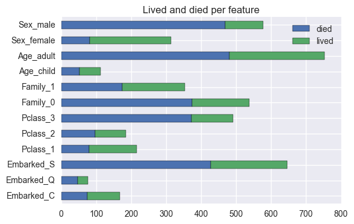

# Summary for project 5

This was an interesting project, where I had the chance to apply several machine learning algorithms to a real world dataset.  The goal was to predict who survived the unfortunate Titanic disaster in 1912.

The data was relatively clean, and obtained via a psql database.  After importing it, it was possible to manipulate the data using Python.

Results were not always what I expected. For example, I was expecting distance weighted knn to give better results than "simple" knn and it didn't.  This is probably because most of the features used in this dataset are "discrete" features, so the distance between data points lost its meaning.

I could also see that knn is a relatively robust algorithm, despite its simplicity.

It's interesting to see that there are very strong correlations between some variables and wether the passenger survived or not.  They can be observed in the following plot:

- Most males died, while most females survived.

- Most adults (>18 years old) died, but about half the children survived.

- About half the people traveling with family members survived, but most of the people traveling alone died.

- Passengers in a higher class (1st class) had a much greater chance of survival than passengers in lower classes.

- The port where people embarked also had influence on who survived, maybe because of how cabins were distributed to the passengers (and some might be closer to the lifeboats).

Full details in this notebook in my Github repo:

[Repo](https://github.com/acardocacho/DSI_LDN_1_HOMEWORK/blob/w05proj/ana/week05-project/project05.ipynb)
