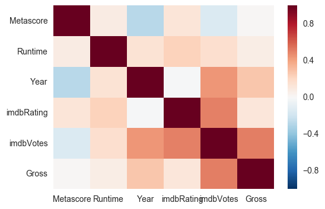
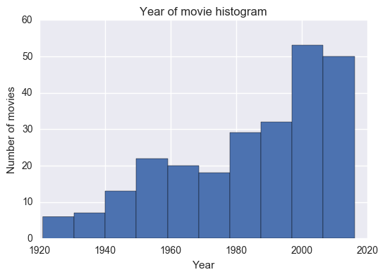
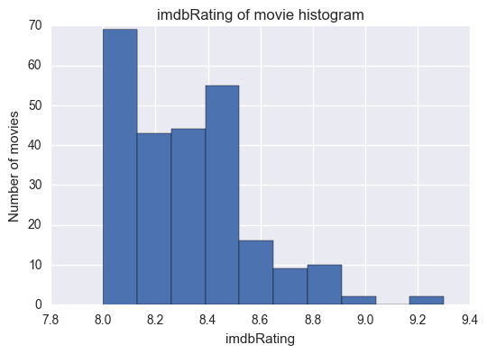
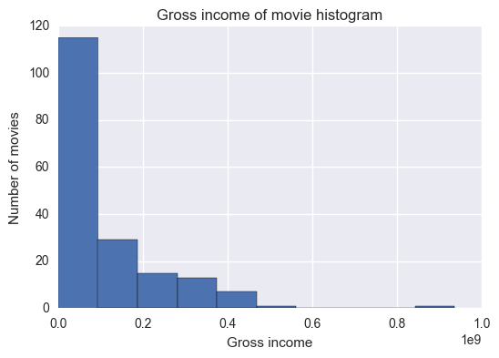

# Summary for project 6

For this project I was asked to scrape data about the 250 most popular movies from IMBD's website, and use that data to predict gross revenue.

Problem statement: What factors are the most direct predictors of gross revenue? 

Goal: Completed Jupyter notebook that includes modeling using a random forest and a blog post explaining your findings.

Of the 250 most popular movies, I was able to find gross values for 143. This is a rather small set of samples, so I tried to improve the dataset by augmenting the number of features. I created boolean variables for actors, directors, languages, countries, and genres, and I hoped that I would get good results by using different regressors with all these features. The problem is that the trees that give best results tend to be deep and they become harder to understand.

This figure shows the correlations between numeric variables in this dataset.  Darker colours mean higher correlations (the diagonal is the darkest, because each variable is highly correlated to itself).

Regarding the 250 most popular movies, we can see that: 

- the distribution of the year is negatively skewed, that is, there are more recent movies in this list than old movies.

- all ratings are above 8 (it makes sense that popular movies have high rates).

- gross income is positively skewed: the vast majority of movies have relatively low gross values compared to the very few highest grossing movies.

- more recent movies tend to have higher gross incomes, more votes and higher ratings.

- movies with higher ratings tend to also have more votes.

- movies with higher ratings / more votes tend to have higher gross values, but it's not a very clear trend.

(complete set of figures in the notebook)

## Summary:

From the results that I obtained, I can conclude that the number of votes that a movie has is a good predictor of how much it will gross. Also, directors J.J. Abrams and Steven Spielberg seem as good bets for blockbusters. The most popular genres are adventure, animation, and fantasy.

A possible way to improve predictive results would be to consider the number of oscars wins/nominations of each movie. This could have been retrieved from the present data, if I had the time to do that.

Full details in this notebook in my Github repo:

[Repo](https://github.com/acardocacho/dsi-projects/blob/master/week06-project/project06.ipynb)
