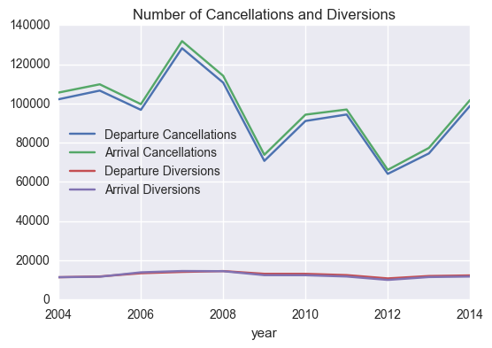
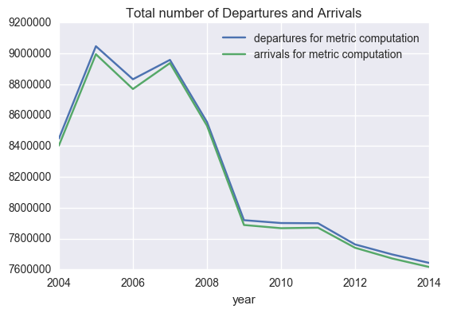
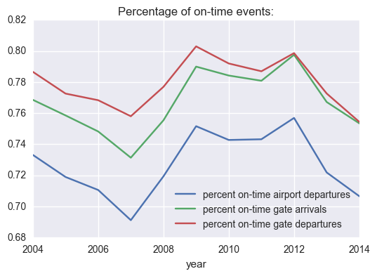

# Summary for project 7

The goal of this project is to analyze the operations of major airports around the country, and to understand the distribution, characteristics, and components of individual airports operations that are leading to delays, so that these delays can be minimized.

The main goal is to cut down on delays nationwide, and to do this we need to understand the characteristics and groupings of airports based on a dataset of departure and operational delays. When a flight takes off, its departure delay is recorded in minutes, as well as operational data relating to this delay. At the end of the year, this data is averaged out for each airport. The datasets have these averages for a 10 year range between 2004 and 2014.
Over this 10 year range, some delay times have not improved or have worsened.

We need to combine three different datasets related to airport operations and use them to identify problematic airports or other relevant data.   These datasets include a dataset detailing the arrival and departure delays/diversions by airport, a dataset that provides metrics related to arrivals and departures for each airport, and a dataset that details names and characteristics for each airport code.

We also need to organize and store this data so that the FAA can easily understand and use it after our work is done.  This needs to be done in a PostgresSQL database.

There are some risks and assumptions to these datasets:

- I am assuming that the data is correct and that all columns use reasobable measuring units.

- I am not considering external factors, not included in these datasets.

- I am assuming that all other factors remained constant (for example, no other runways were built) during the period for which I have data, and for the period of my predictions.

- The data is agregated by year/airport, and I have no way to "dis-aggregate" it.

- There might have been extreme circumstances that influenced some of the delays (strikes, extreme weather conditions, etc), but I have no way to find out how much of the delays was due to these external influencers.

From the folowing two plots we can see that between 2014 and 2014, for the aiports considered:
1. The numbers of Departure Diversions and Arrival Diversions haven't changed much.

2. The numbers of Departure Cancellations and Arrival Cancellations have varied considerably, with a spike in 2007.

3. The numbers of "departures for metric computation" and "arrivals for metric computation" have decreased considerably.  (This can be bacause there are fewer flights to/from these airports or because metrics/rules changed.)

4. Numbers for types of arrivals and departures follow a similar trend.

5. Even though the numbers of "departures for metric computation" and "arrivals for metric computation" have decreased considerably, specially since 2007, the numbers of Departure Cancellations and Arrival Cancellations have not followed a similar trend.

From this plot we can see that the number of on-time events (gate departures, airport departures, and gate arrivals) decreased until 2007, improved sharply betwwen 2008 and 2009, but has gotten worse again until 2014.  Once more, departures and arrivals seem to follow similar trends.

## Summary:

Unfortunately, I was unable to find any meaningful subgoups using clustering.  This may be because I applied PCA, as requested in the starter code, but I had already droped features that were correlated.  I should probably try to redo the analysis without PCA and see if I could get more understandable results.

I would say that Random Trees would be more useful to understand why airports have delays, because the way they are built would allow me to explain which variables contribute to bigger delays.  This is something that I would like to try in the future.

This project asked me to use clustering, after creating dummy variables and scaling, so now I am unable to interpret what these new dimensions mean and get insightful information from the data.

I tried to find examples in the course material where we did a similar task with clustering and was unable to find it.

Rather than spend more time on this project, I prefer to start working on the capstone project, which is why I am submitting an incomplete version.  Anyway, I think that the initial analisys was interesting, and I will try to understand how to use clustering later.

Full details in this notebook in my Github repo:

[Repo](https://github.com/acardocacho/DSI_LDN_1_HOMEWORK/blob/master/ana/week07-project/project07.ipynb)
