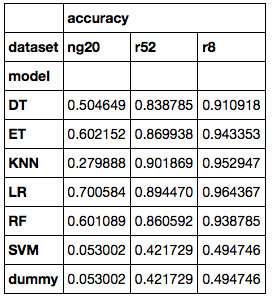

# Capstone Project Part3

## Mine: Correlate data and run statistical analysis

These three datasets are actively used for research in text categorisation, and they have a pre-defined train/test split to facilitate comparison of results.  This is the split that I will use throughout my project.

The first step is to read all the files and check that the number of documents in each category matches what was previously published.  Looking at the `xxx_counts` dataframes and comparing them with the tables in [this webpage](http://ana.cachopo.org/datasets-for-single-label-text-categorization), we can see that they match.

Use `CountVectorizer` to extract the words used in each training set.  It's interesting to see that the 20Newsgroups dataset has a much bigger vocabulary than either of the Reuters datasets.  Also, `r8` is a subset of `r52`, and it has a smaller vocabulary.

## Refine: Plot data with visual analysis

Visualize my data using two or more of the data-viz tools we've covered in class.

The number of train and test documents is approximately ballanced for all the classes in the `ng20` dataset.  Also, there's the usual 2/3 1/3 train/test split.

The class distribution for the documents in the Reuters  dataset is very skewed, with the two most frequent classes containing approximately 70% of all the documents.  Also, even within each class, there's nolonger the usual 2/3 1/3 train/test split.

Even considering only the 8 most frequent classes, the two most frequent classes in this dataset now account for approximately 80% of all the documents.   Also, even within each class, there's nolonger the usual 2/3 1/3 train/test split.

### Word clouds for each dataset

Most of the words in r52 and r8 are common to both word clouds, given that r8 is a subset of r52.

## Preliminary accuracy results

The initial results obtained for each dataset and model can be seen in
the following table.

## Present: Summarise approach and initial results; describe successes, setbacks, and lessons learned

In part 3 of this project I was able to load and pre-process the three datasets that I will use for my work, and it all went as expected.

The results of my initial analisys agree with what was previously published regarding the number of documents per class, both for training and test sets.  I also created a "word cloud" with the 50 most common words for each dataset.  As expected, most of the words in r52 and r8 are common to both word clouds, given that r8 is a subset of r52.

Then I ran some models on all datasets and collected some results.  The DummyClassifier gets exactly the same as previously published, but other models get different results.  This is because feature selection was the same for all datasets, not optimised for each one individually.

Now I need to work on optimising feature selection for each dataset and also on parameter tuning for each model/dataset pair, so that I can properly compare my results with what has been previously published.

From this initial running of the models I learned that they will take some time to run in my machine, so I need to be prepared for that and plan in advance.  Also, it is a good idea to persistently store intermediate results, so that I don't need to run everything from scratch every time.

Full details in this notebook in my Github repo:

[Repo](https://github.com/acardocacho/DSI_LDN_1_HOMEWORK/blob/master/ana/capstone/Ana-Capstone-Part3.ipynb)
