## Problem statement, goals and success criteria

Text Classification techniques are necessary to find relevant information in many different tasks that deal with large quantities of information in text form.  Some of the most common tasks where these techniques are applied include: finding answers to similar questions that have been answered before; classifying news by subject or newsgroup; sorting spam from legitimate e-mail messages; finding web pages on a given subject, among others. In each case, the goal is to assign the appropriate class or label to each document that needs to be classified. 

Depending on the application, documents can be classified into one or more classes.  For instance, a piece of news regarding how the Prime Minister spent his holidays may be classified both as politics and in the social column.  In other situations, however, documents can have only one classification, for example, when distinguishing between spam and legitimate e-mail messages.  The focus of this work is where each document belongs to a single class, that is, single-label classification.

I will use multiple Machine Learning models and compare how well they perform on single-label text classification tasks using some well known public datasets that are actively used for research.

The main goal is to reproduce part of my PhD work using state-of-the-art libraries in Python (sklearn, matplotlib, seaborn), and be able to assess how this area evolved in the past 10 years.

I consider this work will be successful if I am able to reproduce the initial "related work" from my thesis, which at the time took over one year to complete, for this capstone project.  I expect results to be approximately the same as previously published results, and I will even apply some Machine Learning models that I did not use at the time, but that are currently available in the libraries I will use.

## Explain data and run statistical analysis

There are many datasets that are actively used for research in text categorisation.  The reason to have "standard" datasets available for research is to facilitate the comparison of results from different algorithms and different researchers.  Some of these datasets already have a pre-defined train/test split, once more to facilitate comparison of results across different settings.  I chose to use three of the datasets publicly available, with the pre-defined train/test split for each one of them.  The datasets were available as .csv files from [this webpage](http://ana.cachopo.org/datasets-for-single-label-text-categorization).

### 20 Newsgroups

The 20Newsgroups dataset originated from Jason Rennie's page and is a collection of approximately 20,000 newsgroup documents, partitioned (nearly) evenly across 20 different newsgroups.  In this work I will use the "bydate" version, because it already had a standard train/test split.

### Reuters-21578

The Reuters-21578 dataset originated from from David Lewis' page and is a collection of documents that appeared on the Reuters newswire in 1987 and were manually classified by personnel from Reuters Ltd.  In this work I will use the standard "modApté" train/test split.

Due to the fact that the class distribution for these documents is very skewed, two sub-collections are usually considered for text classification tasks:

- R10 - The set of the 10 classes with the highest number of positive training examples.
- R90 - The set of the 90 classes with at least one positive training and testing example.

Moreover, many of these documents are classified as having no topic at all or with more than one topic.  As the goal in this work is to consider single-labeled datasets, all the documents with less than one or with more than one topic were eliminated. With this, some of the classes in R10 and R90 were left with no train or test documents.

Considering only the documents with a single topic and the classes which still have at least one train and one test example, we are left with 8 of the 10 most frequent classes and 52 of the original 90.

Following the usual convention, I will call these sets `r8` and `r52`.  Note that from R10 to `r8` the classes 'corn' and 'wheat', which are intimately related to the class 'grain' disapeared and this last class lost many of its documents (because they had multiple labels).

### Exploratory data analysis (EDA)

#### Plot numbers of train and test documents per class for each dataset

These plots show the distribution of documents per class for each dataset.

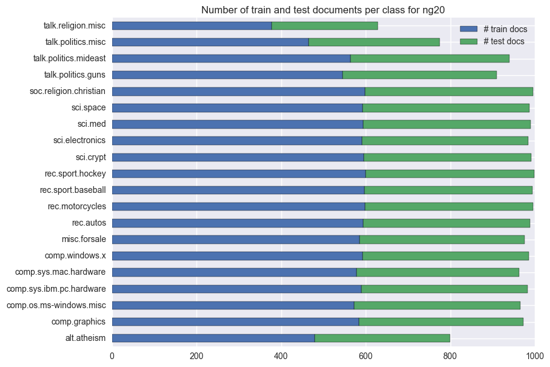

The number of train and test documents is approximately ballanced for all the classes in the `ng20` dataset.  Also, there's the usual 2/3 1/3 train/test split.

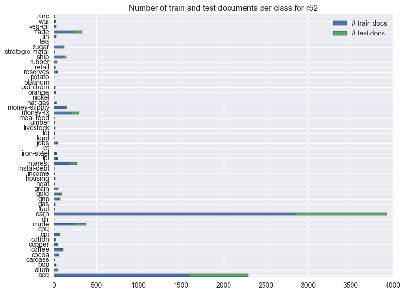

The class distribution for the documents in the Reuters  dataset is very skewed, with the two most frequent classes containing approximately 70% of all the documents.  Also, even within each class, there's nolonger the usual 2/3 1/3 train/test split.

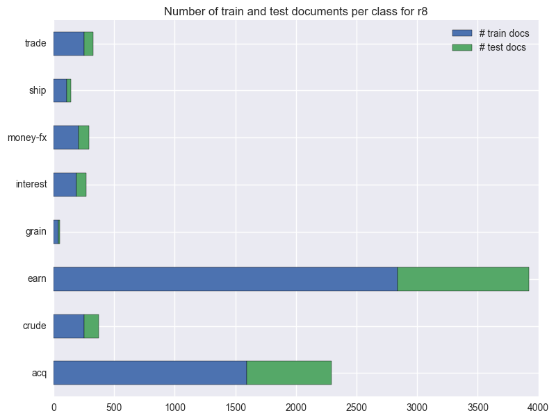

Even considering only the 8 most frequent classes, the two most frequent classes in this dataset now account for approximately 80% of all the documents.   Also, even within each class, there's nolonger the usual 2/3 1/3 train/test split.

#### Count numbers of features for each dataset

Find the words used in each training set.  I use only the training set because that's what the ML models will be able to use in the training phase.  The test set is only used for testing, so it should not be used to determine the set of features.

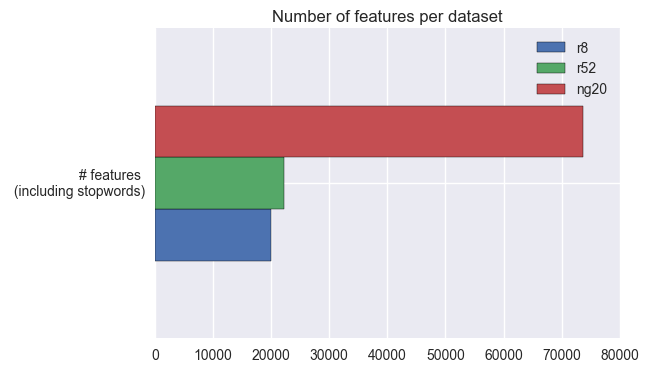

From the last two plots together, we can see that:

- The 20Newsgroups dataset has a much bigger vocabulary than either of the Reuters datasets.
- Because `r8` is a subset of `r52`, it has a smaller vocabulary (this was to be expected), but not much smaller.
- Even though the number of train documents does not even double from `r52` to `ng20`, the number of features (or different words) more than triples.  We can conjecture that people use more words when they are freely posting to newsgroups than when they are writing newswire articles.

#### Create word clouds for each dataset

Here I will compare two word clouds for each dataset, one before and one after removing stopwords.  The word clouds contain the most common words in the dataset (once more, considering only the training set).  It should be interesting to see if the most common words change significantly  by removing english stopwords.  Stopwords are very common words in a language, that appear frequently in texts, but that do not have a high discriminative power.  Examples of stopwords in english are "the", "to", and "and".

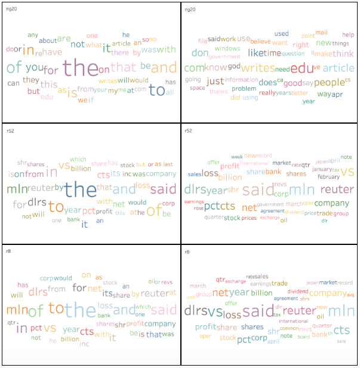

These word clouds look nice, but that's not the only reason why they are here.  By looking at them we can take some valuable insights:

- I labeled each word cloud with the dataset, but I did not indicate if it was before or after removing stopwords.  We can easily see that the in the left column all clouds contain big words like "the", "to", "of". These words do not bring much to the meaning of a sentence, and they do not appear in the clouds in the right.  The clouds in the right are the ones obtained after removing stopwords.
- After removing stopwords (clouds in the right column), word sizes are more uniform (as are word counts).
- Words in the `ng20` and `r*` clouds are very different.  This can be attributed to these datasets being about different subjects.
- Words in the `r52` and `r8` clouds are more similar.  This can be attributed to `r8` being a subset of `r52`, thus about some of the same subjects.

## Apply different models to data 

Here I start by reproducing (as closely as possible) some of the previously published results for these datasets.  I then work on improving those results by using different models, or features, or optimising model parameters.  I use the standard train and test splits for these datasets, so that these results are comparable to others: train using the train set (eventually using cross-validation), evaluate using the test set (which was not seen by the model before).

### Reproduce previous results for these datasets

The first goal is to be able to reproduce previously published results for these datasets.  I will apply the ML models mentioned in the [webpage from where I got the data](http://ana.cachopo.org/datasets-for-single-label-text-categorization).  We can see a summary of those results in the following table.  This table includes two datasets that are not used in this work, because they are not as well known in the literature (WebKB and Cade12).

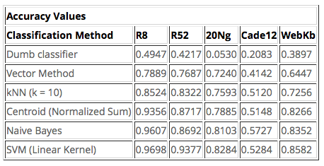

#### Difficulties encountered when trying to reproduce previous work

- The implementation of tfidf feature selection is not the same, because sklearn uses smoothing and my initial implementation did not.  This fact alone will lead to different results in all models that use these features for classification.
- Not all previous models have a direct implementation in sklearn, so for some of them I had to choose the most similar model that I could find in sklearn, and expect results to be different.
- This is a very short description of the ML models that were used and how they were implemented here, if there was not a direct way of doing so:

    - The "Dumb Classifier" determines the class of a test document by finding the most frequent class in the train set and returning it every time.
    - The "Vector Method" determines the class of a test document by finding the most similar train document (using cosine similarity) and returning its class.  It was implemented in this work by using kNN, where the number of "neighbours" to consider is 1.
    - The "kNN (k=10)" method determines the class of a test document by finding the k most similar train documents (using cosine similarity) and returning the most frequent class in those documents.
    - The "Centroid" method determines the class of a test document by finding the most similar centroid and returning its class.  In sklearn this method calculates one centroid for each class by determining the mean of all the documents in that class.  In my thesis, I calculated the centroid for each class by determining the sum of all the documents in that class and normalising it to unitary length.
    - The "Naive Bayes" method determines the class of a test document as the most likely class given the document's terms.
    - The "SVM (Linear Kernel)" method determines the class of a test document by projecting it into a high-dimensional hyperspace and determining wich class corresponds to the "hyperpoint" it was projected into.

Here are both the webpage results and the present work results syde by side.

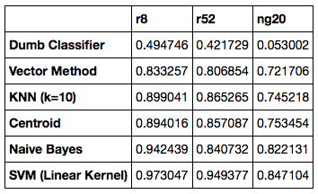

Actually, it's simpler to visualise if I plot the differences in accuracy between the present results and the results in the webpage for each dataset and ML model.

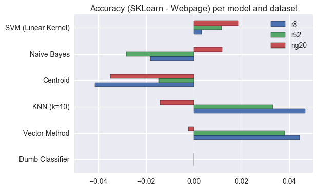

By observing this plot we can see that there are some accuracy differences between the results obtained now and the results that were in the webpage (the largest difference is less than 5%).  Most of the differences can be attributed to the different algorithms to calculate tfidf, but it is still worth noting that:

- The "Dumb Classifier" has the same results for all datasets in both settings because it only uses the document's class (or label) for classification. (If this was not the case, something would be very wrong!)
- The "Centroid" method has very different implementations in sklearn and my thesis, and the one in my thesis is consistently better for all datasets. (Maybe my way of calculating the centroids should be incorporated into sklearn.)
- The new tfidf implementation affects results, but not always for the better.  It also seems to affect `ng20` and `r*` datasets in different ways, because when one of them improves the other worsens and vice versa (except for Centroid and SVM).
- The dataset that seems to be less affected by the new way to calculate tfidf is the `ng20`, where all accuracy differences are less than 2% (except for Centroid).
- Both `r8` and `r52` are affected in a similar way for each model.  This makes sense, because they were both derived from the same initial dataset, so they should have similar characteristics.

###  Use LSI (Latent Semantic Indexing) to improve results

Part of my thesis work was using LSI to reduce the dimensionality of the datasets, while at the same time hoping to improve accuracy of the results.

At the time, I used LSI alone and combined with kNN, Centroid and SVM and observed that results improved in general, but not when combining LSI and SVM.  I will compare LSI with the vector method, because it applies the same model, but to different feature vectors.

We can see that using LSI to reduce the dimensionality of the dataset improves results for the `r*` datasets, but not for `ng20`, when using "simple" ML models like Vector or kNN.  Also, models that already greatly change the initial dataset (SVM by changing dimensions; Centroid by using a single vector to represent an entire class) get worse results when combined with a further dimensionality reduction.

###  Use more ML models

After reproducing some of the results from my thesis, I decided to apply other ML models that I had not used at the time, to see if I could improve results using some of the models available in sklearn.

How do the models compare to the ones before, in terms of Accuracy?

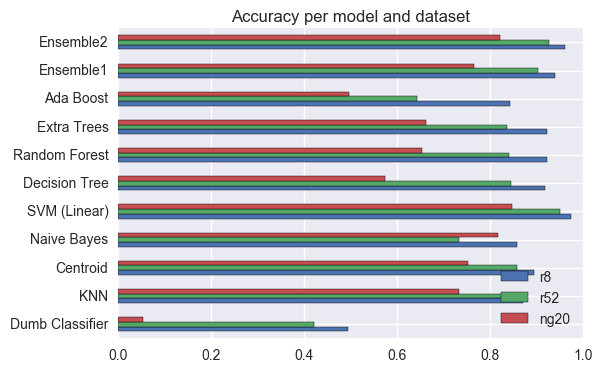

The idea behind applying new models to the same datasets was to see if it was possible to improve results.  Looking at the previous plot, we can see that

- SVM is still the best model for all datasets.
- The Dumb classifier is still the worst model (included as a baseline).
- AdaBoost and ExtraTrees don't always improve results when compared to DecisionTree.
- Using Ensembles does not improve results a lot in this case.  SVM already behave very well, so even an Ensemble including them does not improve results enough to be interesting in this case.

###  Optimise parameters for some ML models (using GridSearchCV)

In the previous section, all models were used using the default values for their parameters.  Now, I will use GridSearchCV to see if those results can be improved by using different parameters.  I will do so only for the most promising models, due to time constraints.

Does optimising parameters actually improve Accuracy?

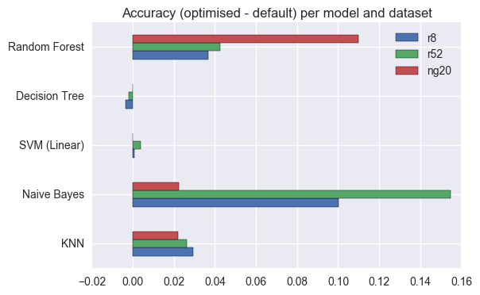

From the previous plot, we can see that using GridSearchCV it was possible to improve results for some of the models.  There is no guarantee that the parameters chosen by GridSearchCV are the absolute best ones, but at least it's reassuring to see that results did not get worse for the parameter combinations that were tested.

- Results for DesisionTree and SVM changed very little, which means that default values for the parameters already work as well as possible with these datasets.
- I was impressed to see how much results improved for NaiveBayes by setting `fit_prior` to `False`.  This means that using a uniform prior for class probabilities improves results, specially when the datasets are extremely skewed (like `r8` and `r52`).
- It was interesting (although not unexpected) to see that increasing the number of estimators improves results for RandomForest (but also increases the time it takes to run).
- Increasing the number of neighbours in KNN also improves results, but different datasets have different optimal numbers of neighbours.

###  Time ML models (with best parameters) and compare results

Finally, I want to look at absolute values for accuracy, and compare how well each model performs with each dataset (using only the best parameters for each dataset).  I also want to consider how long the models take to train and test, because in a real setting it may be better to have a slightly worse model, it is much faster.

As a side note, I should add that I timed one train and one test per model and dataset, and this is not ideal.  Many things can influence how long a model takes to train that do not depend on the model (Did the system perform a garbage collection? Are there other threads computing for CPU?), so to get more trustworthy times I should time several runs and get average times for them.

Apply the optimised models to each dataset.

How do models compare in Accuracy?

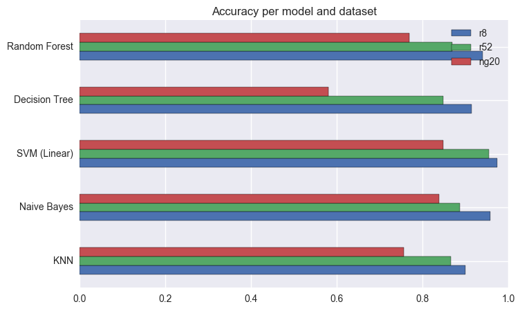

We can see that most optimised models perform well enough for these datasets, in particular for `r8` and `r52`.

The best model overal continues to be SVM using a linear kernel.

Is there a dataset that is "harder" than others?

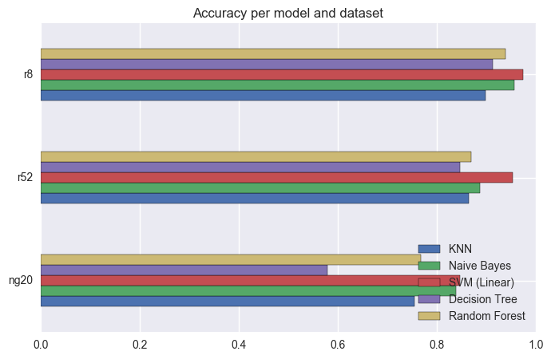

Looking at the length of these bars, we can see that `ng20` is the "hardest" dataset, followed by `r52` and finally `r8`.

How do these models compare in terms of how long they take to train and test?

(Datasets have different sizes, so agglomerate by them.)

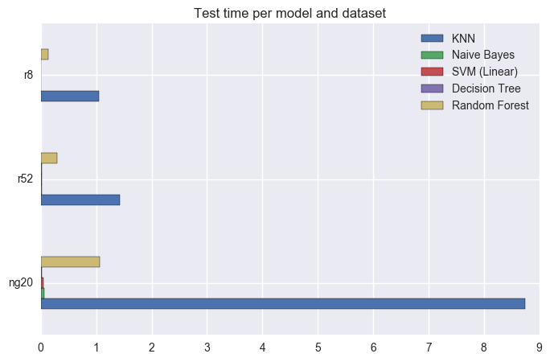

Can we have all these in one plot, and look at all these results at the same time?

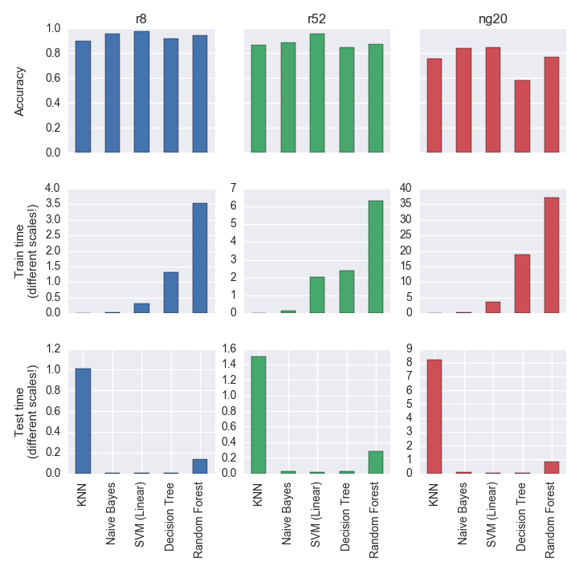

Before starting to comment on these results, it's worth remembering that the Dumb Classifier had accuracy values of 0.49 for `r8`, 0.42 for `r52`, and 0.05 for `ng20`.  Looking at the plots in the top row, it's easy to see that these models have much better results.

I did not say much about training and testing time before, but looking at the bottom two rows shows an interesting trend: in general, models that take longer to train (because they are creating their own representation of the dataset) will be faster to test and vice-versa.  The model that is faster to train is kNN, because it just needs to load the dataset; but every time it needs to classify a document, it needs to search the entire dataset for the closest document, so it's very slow.  I said "in general" before, because RandomForest takes longer to train than DecisionTree (because it needs to generate multiple trees), but it also takes longer to test (because it needs to take into account results from different trees), so it's the exception to the rule.

Ideally, we would like to have a model that has a very high accuracy, but is also fast to train and (more importantly) test.  The model with highest Accuracy for all datasets is SMV.  This model is also one of the fastest to train and test.

From these results I would say that, for a single-label text classification task, if you have to choose one model to implement and optimise, choose SVM using a linear kernel.

## Summary

In the beginning of this project, I wrote that "The main goal is to reproduce part of my PhD work using state-of-the-art libraries in Python (sklearn, matplotlib, seaborn), and be able to assess how this area evolved in the past 10 years."

I think that I was able to achieve this goal, go a bit further, and there still is a lot of future work to be done.

### Approach and results

I started by loading the csv files for the three datasets, and it all went as expected.
The results of my initial analisys agree with what was previously published regarding the number of documents per class, both for training and test sets.  I also created word clouds with the 50 most common words for each dataset, and discussed some interesting aspects.

The first thing I tried was to find in sklearn models that were "equivalent" to the ones that I used in my PhD work.  The algorithm that I used for tfidf is slightly different from the one implemented in sklearn (even after changing some parameters), so the results obtained now are different from previous results (but not too far off).  SVM using a linear kernel still was the best performing model for all datasets.

Then I tried to reproduce what in my PhD work I called "combining LSI with other models".  In sklearn, LSI is considered a feature selection algorithm and is called Singular Value Decomposition.  The main idea is the same (despite the different names).  Like before, combining LSI with SVM worsens results.  I had not combined LSI with centroids in my PhD work; here it worsens results.  In my PhD work, LSI improved results when combined with kNN (when k=1 it's also called vector model), but here this only happens for the `r*` datasets but not for the `ng20` dataset; I imagine it's the different way to calculate tfifd that makes a difference.  In all cases, accuracy is still below the one achieved using SVM with a linear kernel (and standard tfidf feature selection).

After that, I decided to apply some models, available in sklearn, that I had not used in my PhD work.  I was particularly interested in finding out how RandomTrees, Boosting and Ensembles would behave.  In a single sentence: SVM using a linear kernel is still the best model for all datasets.

Then, I went on by using GridSearchCV to optimise parameters for the most promising models.  The goal was to see if it was possible to outperform SVM, if I could find the best combination of parameters.  Some of the models saw their performance increase with the new parameters.  But SVM using a linear kernel still outperforms them all.

Finally, I compared accuracy and execution times for the optimised models.  All things considered, SVM still comes on top, because even though it takes some time to learn the model (but not very long), it is very fast when asked to classify a document.

### Successes, setbacks, and lessons learned

I think that this project was successful, in that I was able to reproduce, and in some cases improve on, previous results.

My first setback was going back to my thesis and remembering what I had done.  It was not always easy to find the models in sklearn to match the models in my thesis, and in some cases both implementations had differences that I was unable to overcome, even after tweaking the parameters.  I did not go back to my Java implementation of some of the models, that would have been overwhelming at this point.

I was really happy to be able to use GridSearchCV to optimise parameters.  I implemented code to run parameter combinations at for my thesis, but then I did the "optimisation" using PivotTables in Excel.  GridSearchCV makes everything much easier.

I still do not master plotting as much as I would like to, and it was hard to decide what the last figure should look like, so that I was able to compare Accuracy and times in the same place.

### Future work

There are so many other paths that this project could have led me to, but with a limited time frame I had to make some hard choices.  I think the line of thought that I explored was interesting, but I could also have chosen to:

- Find more models in sklearn to implement and optimise.  Maybe this would have led to finding a model that was better than SVM.
- Find more datasets to test the available models.  Maybe different models were better suited to use with different languages.
- Explore different algorithms for feature selection, and try out combinations between feature selection parameters and models.
- Use larger parameter grids for GridSearchCV.
- Use other evaluation metrics besides Accuracy, like Precision, Recall, F1, etc.  I chose to use a single measure because it's the most widely used success measure for single-label text classification tasks, and results are easy to intuitively understand.
- Use Amazon Web Services (AWS) to be able to try more models or bigger datasets.  This is a task that can be easily parallelisable, because different datasets can be tested independently.  Then all results can be collected and processed as a whole.

I will definitively do some of these in the future.

### Full details in this notebook in my Github repo:

[Repo](https://github.com/acardocacho/DSI_LDN_1_HOMEWORK/blob/master/ana/capstone/Ana-Capstone-Part4.ipynb)
